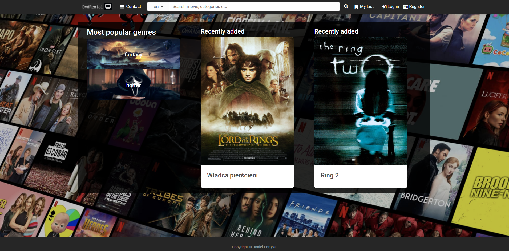

# Movie_and_Series_Rental
#### Website created with Django and MdBootstrap.
 
##### Warning - Due to google less secure applications politcs its recommended to use this test account login: testuser password: dvdrental123
### demo: https://dvdrentaldanielpartyka.herokuapp.com/
### Technologies:
* Python 3.9.7
* Django 4.0.4
* MdBootstrap 3.10.2

### Functionalities:
* registration/login (email confirmation)
* simulation of reservation store via website (reservation->confirmation->rental->return)
* filtrating movies and series by name and their categories
* rating in scale (0-5) movie/series
* contact form (secured by captcha)
## Instalation guide:
##### required python version 3.8+
#### Installing dependencies
```
python -m venv venv 
venv\Scripts\activate
pip install -r requirements.txt
```
#### Database migration
```
cd dvd_rental
python manage.py makemigrations dvd_rental
python manage.py migrate
```
#### Create admin
```
python manage.py createsuperuser
```
#### Application running
```
python manage.py runserver
```
#### !Important
##### In order to activate a user account you need to set the smtp (e.g. gmail smtp)
https://github.com/DanielPartyka/Movie_and_Series_Rental/blob/2f7ece1f7a0d0d085d09bda170309a71375559ed/dvd/settings.py#L28-L32


